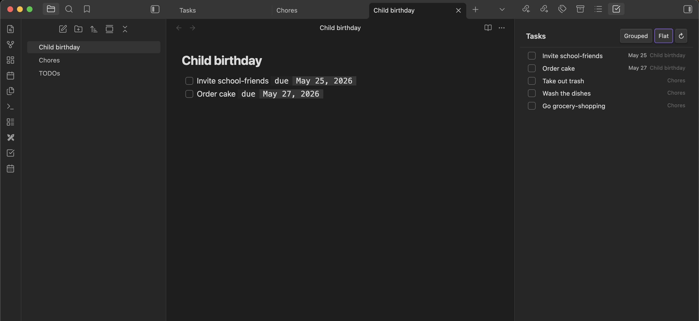

# Tasks Panel

An [Obsidian](https://obsidian.md) plugin that aggregates every task across your vault into a live sidebar panel with due dates, notifications, and completion tracking.



## Features

- **Vault-wide task list** — scans all markdown files; updates in real time as you edit
- **Grouped & Flat views** — group tasks by source note or see everything in one list
- **Due dates** — add `[due:: 2025-06-01]` or `[due:: 2025-06-01 14:30]` to any task
- **Desktop notifications** — fires a notification N minutes before a timed task is due (configurable)
- **Completion timestamps** — checking a task writes `[done:: YYYY-MM-DD HH:MM]` back to the file; unchecking strips it
- **Jump to source** — click a task or its filename to open the note at the exact line

## Installation

### From a release (recommended)

1. Download `main.js`, `manifest.json`, and `styles.css` from the [latest release](../../releases/latest)
2. Create `<vault>/.obsidian/plugins/obsidian-tasks-panel/` and place the three files inside
3. In Obsidian: **Settings → Community plugins → enable Tasks Panel**

### For development

1. Clone this repo directly into your vault's plugins folder (or symlink it there)
2. Run `bun install && bun run build`
3. In Obsidian: **Settings → Community plugins → enable Tasks Panel**

## Usage

Open the panel via the ribbon icon (☑) or **Ctrl/Cmd+P → "Open Tasks panel"**.

### Due dates

| Syntax | Meaning |
|---|---|
| `[due:: 2025-06-01]` | Date-only due date |
| `[due:: 2025-06-01 09:00]` | Date + time (enables notifications) |

Set or update a due date on the current task line with **Ctrl/Cmd+P → "Set due date"** — opens a date/time picker and writes the annotation for you.

### Recurring tasks

Add `[repeat:: every ...]` to a task that also has a `[due::]` date to make it automatically reschedule instead of staying done forever:

| Syntax | Meaning |
|---|---|
| `[repeat:: every day]` | Every day |
| `[repeat:: every 3 days]` | Every 3 days |
| `[repeat:: every week]` | Every week |
| `[repeat:: every 2 weeks]` | Every 2 weeks |
| `[repeat:: every month]` | Every month |
| `[repeat:: every year]` | Every year |

`[repeat::]` **requires a `[due::]` date to have any effect** — with no due date it's inert and the task behaves like a normal one-off task.

Completing a recurring task doesn't mark it done: instead of getting a `[done::]` timestamp, its checkbox stays unchecked and its `[due::]` is rewritten to the next occurrence (skipping ahead past any missed cycles if it was badly overdue). No completion history is kept for that task — the panel shows a brief notice ("Advanced to ...") as the only feedback, and a small repeat icon next to the due date marks it as recurring in the list.

### Excluding a task

Add `[tasks-no-collect:: true]` to a task line to keep it off the panel entirely — useful for checklist items in templates or example checkboxes that aren't real tasks. The task stays untouched in the file; it's just skipped during the scan. Use `[tasks-no-collect:: false]` to explicitly keep a task collected.

To exclude every task in a note, add `tasks-no-collect: true` to its frontmatter instead:

```yaml
---
tasks-no-collect: true
---
```

### Ignoring files and folders

For excluding whole folders (like `Templates/`) without editing every note inside them, configure glob patterns under **Settings → Tasks Panel → Ignored files and folders** — one pattern per line:

| Pattern | Meaning |
|---|---|
| `Templates/**` | Everything under the Templates folder |
| `Archive/**/*.md` | Every markdown file anywhere under Archive |
| `Inbox/scratch.md` | One specific file |

`*` matches within a single path segment, `**` matches across segments (including zero). These are real globs, not gitignore shorthand — a bare `Templates` pattern only matches a file literally named `Templates`, not files inside the folder; use `Templates/**` for that. Changes take effect immediately on save, no reload needed.

### Notifications

Only tasks with a specific time trigger notifications. Configure the lead time in **Settings → Tasks Panel → Notification threshold** (default: 15 minutes). Click a notification to jump to the task.

## Development

```sh
bun install
bun run dev      # watch + rebuild
bun run build    # production build
bun run test     # jest test suite
```

Requires Obsidian ≥ 1.4.0.

## License

MIT
